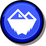
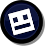
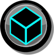

#  Avalanche Index
Official Avalanche levels and profiles.

---

>     
>  
> 

Easily spot legitimate Avalanche profiles and projects at a glance. No more need to double-check.

> [!TIP]
> *This mod has settings you can utilize to customize your experience.*

---

## About
The *Avalanche Index* mod fetches and processes data from an external repository to verify players and levels in-game that are official to Avalanche. The purpose of this mod is to be utilized as a tool by the Geometry Dash players who are active in Avalanche's community to help better discern while in-game between official and otherwise misleading users and levels.

#### Recommended
These mods allow the Avalanche Index mod to work better!

- **[Badges API](https://www.github.com/Jouca/BadgesAPI/)** - *Team badges on comments and profiles*

---

### Badges
###### The members of Avalanche.
When viewing someone's profile or comment, you'll likely see a badge next to their name. This means they form part of, or are associated with, Avalanche in some way. These are the badges that you may see appear next the name of said person. The text color of members' comments will also change depending on their role in the team, unless they are the publisher of the level. Comment text colors can be customized in the mod's settings.

|                                       **Icon**                                        | **Role**                |
| :-----------------------------------------------------------------------------------: | ----------------------- |
|            | Director                |
|         | Manager                 |
|      | Team Member             |
|    | Collaborator            |
|  | **Cubic Studios** Staff |

You can also press the icon of the badge to get more information about the role behind it itself.

---

### Levels
###### The Avalanche team projects.
When viewing level cells or pages, you may notice the changes in the background color. The level is either a team project on Avalanche's publisher account, or a solo or a collaboration hosted and published independently by a team member. These are the colors you may find highlighting such. The title font for team projects will also change.

| **Color**                 |   **Type**   |
| ------------------------- | :----------: |
| **Azure Blue `#425EFF`**  | Team Project |
| **Slate Blue `#464D75`**  |  Solo Level  |
| **Acid Yellow `#D3CF00`** | Event Level  |

Level cells with a glow emerging from the side represent levels in Avalanche's hall of fame. These levels stand out the most among the team's creations. By default, unrated or unlisted levels will not be highlighted.

If a level is featured on Avalanche's servers, you may see a button with the Avalanche logo appear on the left-hand side menu on the level's information page, or the right-hand side menu on the pause menu while playing the level. Pressing this will create a pop-up giving more information about the level as a project by the team, the type of project it is, its host, etc. You will also see a button to watch its full showcase video.

---

### Featured
###### The up-and-coming Avalanche project.
In the main menu, you may see a button in the center with the Avalanche logo. When pressed, it will create a pop-up displaying the latest Avalanche team project. You will have the option to check out the latest video or update of the project. The information button may direct you to fill out an application to join the team to then begin working on the project if you wish.

---

### Changelog
###### What's new?!
**[📜 View the latest updates and patches](./changelog.md)**

### Issues
###### What's wrong?!
**[⚠️ Report a problem with the mod](../../issues/)**

### Development
###### Work with the mod directly.
**[⌨️ Check the API out](./incl/)**

---

### Developers
###### This mod is developed and maintained by **[Cubic Studios](https://www.cubicstudios.xyz/)**, and members and collaborators of the [ Avalanche](https://avalanche.cubicstudios.xyz/) team.