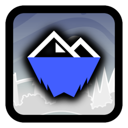

#  Avalanche Index
Avalanche-associated accounts and levels.

>     
>  
> 

View a user's profile to see if they are a member of Avalanche!

This mod fetches data for badges from a remote repository, to ensure that all information is always up-to-date without the need of constant manual mod updates. You may also press the in-game badge for more information on the member's role in the team.

### Badges
###### What role each badge represents.
| **Icon**                                                                       | **Role**             |
|:------------------------------------------------------------------------------:|----------------------|
|            | Director             |
|         | Manager              |
|      | Team Member          |
|     | Collaborator         |
|  | Cubic Studios Staff  |

You may also view levels that are Avalanche team projects.

### Developers
###### This mod is developed and maintained by members and collaborators of the  [Avalanche](https://avalanche.cubicstudios.xyz/) team.
 **[Cheeseworks](https://www.github.com/BlueWitherer/)**

### Changelog
###### What's new?!
**[📜 View the latest updates and patches](changelog.md)**