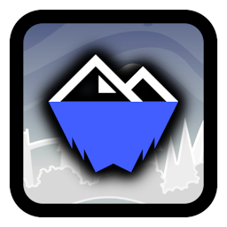

#  Avalanche Index
Official Avalanche levels and profiles.

### Development
###### Work with the mod directly.
You can access data from the Avalanche Index by including the [`Avalanche.hpp`](Avalanche.hpp) file in your code. Make sure to use the `avalanche` namespace to directly access all the needed classes and values.

```cpp
#include <cubicstudios.avalancheindex/incl/Avalanche.hpp>

using namespace avalanche;
```

Use the `Handler` class's functions through `Handler::get()` to access functions that fetch saved data on badges and levels. Some fields may contain data based in `Project::Type` and `Profile::Badge` enum classes.

```cpp
using namespace avalanche;

Handler getHandler = Handler::get();

class $modify(ProfilePage)
{
	void loadPageFromUserInfo(GJUserScore *user)
	{
		ProfilePage::loadPageFromUserInfo(user);

		Profile avalUser = getHandler.GetProfile(user->m_accountID);

		if (avalUser.badge != Profile::Badge::NONE)
        {
            log::info("{} is an Avalanche member! Hooray!", avalUser.name);

			if (avalUser.badge == Profile::Badge::DIRECTOR)
			{
				log::info("Woah! {} is the director of Avalanche!", avalUser.name);
			};
        };
	};
};
```

```cpp
using namespace avalanche;

Handler getHandler = Handler::get();

class $modify(Level, LevelCell)
{
	void loadFromLevel(GJGameLevel *level)
	{
		LevelCell::loadFromLevel(level);

		Project avalLevel = getHandler.GetProject(level->m_levelID.value());

		if (avalLevel.type == Project::Type::TEAM)
		{
			log::info("The level '{}' is an Avalanche project hosted by {}!", avalLevel.name, avalLevel.host);
		}
		else if (avalLevel.type == Project::Type::EVENT)
		{
			log::info("The level '{}' by {} won an Avalanche event!", avalLevel.name, avalLevel.host);
		};
	};
};
```

You are not required to update data manually as this mod does it by itself! Happy modding!